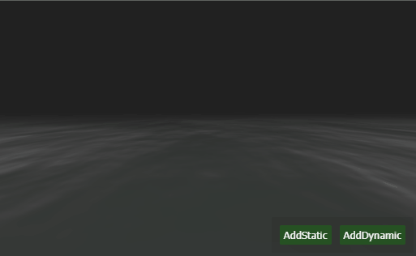

<strong>

Threejs + Cannonjs + WebWorker + SharedArraybuffer

-   基础代码框架

    -   Base

        -   TEntity
        -   TActor
        -   TComponent
        -   TManager
        -   TPlugin

    -   Actor

        -   TAmbientLight
        -   TBox
        -   TDirectionalLight
        -   TFog
        -   TGltfModel
        -   TPlane
        -   TPointLight
        -   TSphere
        -   TWater

    -   Manager

        -   TCamera
        -   TGame
        -   TInput
        -   TPhysics
        -   TRenderer
        -   TEditor

    -   Components

        -   TBoxRigidBody
        -   TSphereRigidBody

    -   Decorators

        -   TEvent
        -   TTest
        -   TTool

    -   Plugins

        -   TFreeCameraControl
        -   TRoundCameraControl

    -   Worker

        -   Physics

</strong>

-   基础渲染完成

-   物理模拟完成（ WebWorker配合SharedArraybuffer ）

